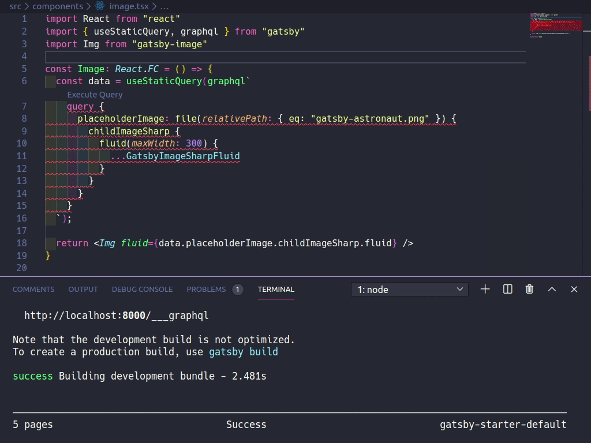
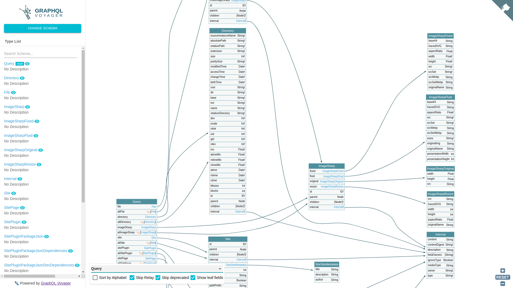
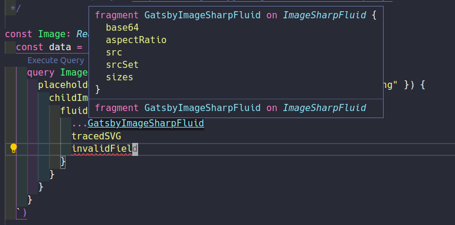

# gatsby-plugin-typegen

[](https://www.npmjs.com/package/gatsby-plugin-typegen) 

Watch your queries and automatically generates TypeScript/Flow definitions.

- [x] Schema extraction
- [x] Generates type definitions using [graphql-codegen](https://graphql-code-generator.com/)
- [x] Auto-fixing `<StaticQuery>` and `useStaticQuery()` in code with generated type name.
- [x] Integrate Gatsby project with GraphQL & TypeSCript ecosystem.

## Demo



## Install

```bash
yarn add gatsby-plugin-typegen

# or
# npm install --save gatsby-plugin-typegen
```

## How to use

```js
// In your gatsby-config.js
plugins: [`gatsby-plugin-typegen`]
```

### Example of type-safe usage

```ts
import { PluginOptions as TypegenPluginOptions } from 'gatsby-plugin-typegen/types';

type Plugin = (
  | string
  | { resolve: string, options: any }
  | { resolve: `gatsby-plugin-typegen` options: TypegenPluginOptions }
);

const plugins: Plugin[] = [
  {
    resolve: `gatsby-plugin-typegen`,
    options: {
      // ... customize options here
    },
  },
];

module.exports = {
  plugins,
};
```

### Change the output path

```js
{
  options: {
    outputPath: `src/__generated__/gatsby-types.ts`,
  },
}
```

### Switch to Flow

```js
{
  options: {
    language: `flow`,
    outputPath: `src/__generated__/gatsby-types.flow.js`,
  },
}
```

### Emit schema as GraphQL SDL

```js
{
  options: {
    emitSchema: {
      `src/__generated__/gatsby-schema.graphql`: true,
    },
  },
}
```



Visualized via [GraphQL Voyager](https://apis.guru/graphql-voyager/).

### ESLint

You can use the extracted schema file for [eslint-plugin-graphql](https://github.com/apollographql/eslint-plugin-graphql)!

```js
// gatsby-config.js

module.exports = {
  plugins: [
    // ...
    {
      resolve: `gatsby-plugin-typegen`,
      options: {
        emitSchema: {
          `src/__generated__/gatsby-introspection.json`: true,
        },
      },
    },
  ],
};
```

```js
// .eslintrc.js

const path = require('path');

module.exports = {
  plugins: [
    'graphql'
  ],
  rules: {
    'graphql/template-strings': ['error', {
      env: 'relay',
      tagName: 'graphql',
      schemaJsonFilepath: path.resolve(__dirname, 'src/__generated__gatsby-introspection.json'),
    }],
  },
};
```

### VSCode extension

I recommend to use [Apollo GraphQL](https://marketplace.visualstudio.com/items?itemName=apollographql.vscode-apollo) extension.

(YES, even this isn't Apollo project)

1. Install the [extension](https://marketplace.visualstudio.com/items?itemName=apollographql.vscode-apollo).

2. Configure plugin to emit schema and plugin documents.

    ```js
    // gatsby-config.js

    module.exports = {
      plugins: [
        // ...
        {
          resolve: `gatsby-plugin-typegen`,
          options: {
            emitSchema: {
              `src/__generated__/gatsby-introspection.json`: true,
            },
            emitPluginDocuments: {
              `src/__generated__/gatsby-plugin-documents.graphql`: true,
            },
          },
        },
      ],
    };
    ```

3. Create `apollo.config.js` file in project root.

    ```js
    // apollo.config.js

    module.exports = {
      client: {
        name: 'your-project-name',
        tagName: 'graphql',
        includes: [
          './src/**/*.{ts,tsx}',
          './src/__generated__/gatsby-plugin-documents.graphql',
        ],
        service: {
          name: 'GatsbyJS',
          localSchemaFile: './src/__generated__/gatsby-schema.graphql',
        }
      },
    }
    ```

4. Reload VSCode & Enjoy!\
  

### TypeScript plugin

- [ts-graphql-plugin](https://github.com/Quramy/ts-graphql-plugin)

TODO: Add config example

## Available options

Checkout the full documentation of plugin options from [`src/types.ts`](https://github.com/cometkim/gatsby-plugin-typegen/blob/master/src/types.ts).

## Disclaimer

This plugin is a bit opinionated about how integrate GatsbyJS and codegen.

You cannot customize plugins and its options of graphql-codegen because this plugin is built for **ONLY GatsbyJS**.

If you wanna use codegen with other plugins (e.g. React Apollo), you can use [`@graphql-codegen/cli`](https://www.npmjs.com/package/@graphql-codegen/cli) for it.

Or [gatsby-plugin-graphql-codegen](https://github.com/d4rekanguok/gatsby-typescript/tree/master/packages/gatsby-plugin-graphql-codegen) gives you a more flex options.

## Acknowledgements

- [graphql-code-generator](https://graphql-code-generator.com/) by [@dotansimha](https://github.com/dotansimha)\
  This is where the plugin started.

- [gatsby-plugin-graphql-codegen](https://github.com/d4rekanguok/gatsby-typescript/tree/master/packages/gatsby-plugin-graphql-codegen) by [@d4rekanguok](https://github.com/d4rekanguok)\
  has almost same goal, but little bit different how handle GraphQL documents. @d4rekanguok also makes great contribution to this plugin as well!

- [gatsby-plugin-extract-code](https://github.com/NickyMeuleman/gatsby-plugin-extract-schema) by [@NickyMeuleman](https://github.com/NickyMeuleman)\
  Gives me idea about schema extraction.
