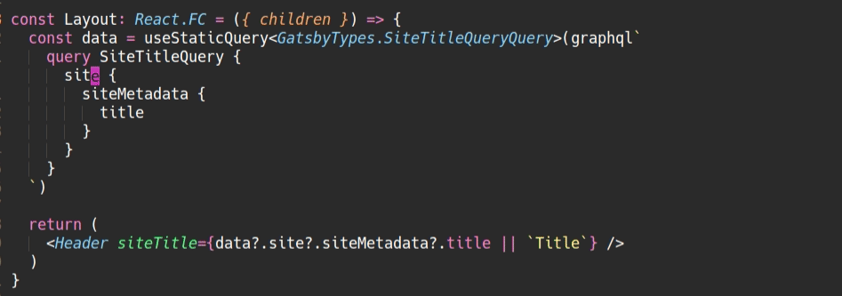

# gatsby-plugin-typegen
[](https://www.npmjs.com/package/gatsby-plugin-typegen)
[](https://www.npmjs.com/package/gatsby-plugin-typegen)
[](https://github.com/cometkim/gatsby-plugin-typegen/actions)
[](https://lgtm.com/projects/g/cometkim/gatsby-plugin-typegen/context:javascript)

<!-- ALL-CONTRIBUTORS-BADGE:START - Do not remove or modify this section -->
[](#contributors-)
<!-- ALL-CONTRIBUTORS-BADGE:END -->

Watch your queries and automatically generates TypeScript/Flow definitions out-of-box.

## Features

- [x] Schema extraction
- [x] Plugin documents extraction
- [x] Generates type definitions using [graphql-codegen](https://graphql-code-generator.com/)
- [x] Auto-fixing `<StaticQuery>` and `useStaticQuery()` in code with generated type name.
- [x] Integrates GatsbyJS project with GraphQL & TypeScript ecosystem.
- [ ] Provides type definitions for the [schema customization](https://www.gatsbyjs.org/docs/schema-customization/).
- [ ] Provides utility types for `gatsby-node.js`.

## Demo


## Install

```bash
yarn add gatsby-plugin-typegen

# or
# npm install --save gatsby-plugin-typegen
```

## How to use

```js
// In your gatsby-config.js
plugins: [`gatsby-plugin-typegen`]
```

### Example of type-safe usage

```ts
import type { PluginOptions as TypegenPluginOptions } from 'gatsby-plugin-typegen/types';

type Plugin = (
  | string
  | { resolve: string, options: object }
  | { resolve: `gatsby-plugin-typegen`, options: TypegenPluginOptions }
);

const plugins: Plugin[] = [
  {
    resolve: `gatsby-plugin-typegen`,
    options: {
      // ... customize options here
    },
  },
];

module.exports = {
  plugins,
};
```

### Change the output path

```js
{
  options: {
    outputPath: `src/__generated__/gatsby-types.d.ts`,
  },
}
```

### Switch to Flow

```js
{
  options: {
    language: `flow`,
    outputPath: `src/__generated__/gatsby-types.flow.js`,
  },
}
```

Add generated typedefs to `.flowconfig`:

```flowconfig
[lib]
./src/__generated__/gatsby-types.flow.js
```

### Emit schema as GraphQL SDL

```js
{
  options: {
    emitSchema: {
      'src/__generated__/gatsby-schema.graphql': true,
    },
  },
}
```


Visualized via [GraphQL Voyager](https://apis.guru/graphql-voyager/).

### ESLint

You can use the extracted schema file for [eslint-plugin-graphql](https://github.com/apollographql/eslint-plugin-graphql)!

```js
// gatsby-config.js

module.exports = {
  plugins: [
    // ...
    {
      resolve: `gatsby-plugin-typegen`,
      options: {
        emitSchema: {
          'src/__generated__/gatsby-introspection.json': true,
        },
      },
    },
  ],
};
```

```js
// .eslintrc.js

const path = require('path');

module.exports = {
  plugins: [
    'graphql'
  ],
  rules: {
    'graphql/template-strings': ['error', {
      env: 'relay',
      tagName: 'graphql',
      schemaJsonFilepath: path.resolve(__dirname, 'src/__generated__gatsby-introspection.json'),
    }],
  },
};
```

### VSCode extension

I recommend to use [Apollo GraphQL](https://marketplace.visualstudio.com/items?itemName=apollographql.vscode-apollo) extension.

(YES, even this isn't Apollo project)

1. Install the [extension](https://marketplace.visualstudio.com/items?itemName=apollographql.vscode-apollo).

2. Configure plugin to emit schema and plugin documents.

    ```js
    // gatsby-config.js

    module.exports = {
      plugins: [
        // ...
        {
          resolve: `gatsby-plugin-typegen`,
          options: {
            emitSchema: {
              'src/__generated__/gatsby-introspection.json': true,
            },
            emitPluginDocuments: {
              'src/__generated__/gatsby-plugin-documents.graphql': true,
            },
          },
        },
      ],
    };
    ```

3. Create `apollo.config.js` file in project root.

    ```js
    // apollo.config.js

    module.exports = {
      client: {
        name: 'your-project-name',
        tagName: 'graphql',
        includes: [
          './src/**/*.{ts,tsx}',
          './src/__generated__/gatsby-plugin-documents.graphql',
        ],
        service: {
          name: 'GatsbyJS',
          localSchemaFile: './src/__generated__/gatsby-schema.graphql',
        }
      },
    }
    ```

4. Reload VSCode & Enjoy!\
  

### TypeScript plugin

The extracted schema file can also be used for [ts-graphql-plugin](https://github.com/Quramy/ts-graphql-plugin). Using the config defined in [Emit schema as GraphQL SDL](#emit-schema-as-graphql-sdl):

```jsonc
// tsconfig.json
{
  "compilerOptions": {
    // ...
    "plugins": [
      {
        "name": "ts-graphql-plugin",
        "schema": "src/__generated__/gatsby-schema.graphql",
        "tag": "graphql"
      }
    ]
  },
}
```



## Available options

Checkout the full documentation of plugin options from [`src/types.ts`](https://github.com/cometkim/gatsby-plugin-typegen/blob/master/plugin/src/types.ts).

## Disclaimer

This plugin is a bit opinionated about how integrate GatsbyJS and codegen.

You cannot customize plugins and its options of graphql-codegen because this plugin is built for **ONLY GatsbyJS**.

If you wanna use codegen with other plugins (e.g. React Apollo), you can use [`@graphql-codegen/cli`](https://www.npmjs.com/package/@graphql-codegen/cli) for it.

Or [gatsby-plugin-graphql-codegen](https://github.com/d4rekanguok/gatsby-typescript/tree/master/packages/gatsby-plugin-graphql-codegen) gives you a more flex options.

## Troubleshooting

### `Error: Cannot use GraphQLSchema "[object GraphQLSchema]" from another module or realm.`

See https://github.com/cometkim/gatsby-plugin-typegen/issues/120

## Changelog

### v2.2.1

- Fixes bug caused by upstream behavior change ([#93](https://github.com/cometkim/gatsby-plugin-typegen/issues/93))

### v2.2.0

- Use union types instead of enum values ([#78](https://github.com/cometkim/gatsby-plugin-typegen/issues/78))
- Emit schema when add a new frontmatter field ([#82](https://github.com/cometkim/gatsby-plugin-typegen/issues/82))

### v2.1.0

- Use `string` type for the GatsbyJS's `Date` scalar by default. ([#73](https://github.com/cometkim/gatsby-plugin-typegen/pull/73))
- Allow to add type mappings for custom scalars. ([#73](https://github.com/cometkim/gatsby-plugin-typegen/pull/73))
- Avoid using unstable API internally ([#71](https://github.com/cometkim/gatsby-plugin-typegen/pull/71), original issue: [#54](https://github.com/cometkim/gatsby-plugin-typegen/issues/54))

### v2.0.1

- Fix multiple query definitions in plugin documents on Windows ([#66](https://github.com/cometkim/gatsby-plugin-typegen/pull/66), original issue: [#44](https://github.com/cometkim/gatsby-plugin-typegen/issues/44))

### v2.0.0

- **[BREAKING CHANGE]** Generated types are now using global declaration with a namespace (default is `GatsbyTypes`).
- Fixed an issue where the insert types function only worked when documents were changed. ([#43](https://github.com/cometkim/gatsby-plugin-typegen/issues/43))

### v1.1.2

- Export inline fragment subtypes. ([#45](https://github.com/cometkim/gatsby-plugin-typegen/issues/45))
- Insert eslint-disable comment on top of generated file. ([#37](https://github.com/cometkim/gatsby-plugin-typegen/issues/37))

## Contributors ✨

Thanks goes to these wonderful people ([emoji key](https://allcontributors.org/docs/en/emoji-key)):

<!-- ALL-CONTRIBUTORS-LIST:START - Do not remove or modify this section -->
<!-- prettier-ignore-start -->
<!-- markdownlint-disable -->
<table>
  <tr>
    <td align="center"><a href="https://blog.cometkim.kr/"><br /><sub><b>Hyeseong Kim</b></sub></a><br /><a href="#maintenance-cometkim" title="Maintenance">🚧</a> <a href="https://github.com/cometkim/gatsby-plugin-typegen/commits?author=cometkim" title="Code">💻</a> <a href="https://github.com/cometkim/gatsby-plugin-typegen/commits?author=cometkim" title="Documentation">📖</a> <a href="https://github.com/cometkim/gatsby-plugin-typegen/issues?q=author%3Acometkim" title="Bug reports">🐛</a> <a href="#ideas-cometkim" title="Ideas, Planning, & Feedback">🤔</a> <a href="https://github.com/cometkim/gatsby-plugin-typegen/pulls?q=is%3Apr+reviewed-by%3Acometkim" title="Reviewed Pull Requests">👀</a></td>
    <td align="center"><a href="https://github.com/relefant"><br /><sub><b>Richard Sewell</b></sub></a><br /><a href="https://github.com/cometkim/gatsby-plugin-typegen/commits?author=relefant" title="Code">💻</a> <a href="#maintenance-relefant" title="Maintenance">🚧</a></td>
    <td align="center"><a href="https://github.com/d4rekanguok"><br /><sub><b>Derek Nguyen</b></sub></a><br /><a href="https://github.com/cometkim/gatsby-plugin-typegen/commits?author=d4rekanguok" title="Code">💻</a> <a href="#maintenance-d4rekanguok" title="Maintenance">🚧</a></td>
    <td align="center"><a href="https://specific.solutions.limited"><br /><sub><b>Vincent Khougaz</b></sub></a><br /><a href="https://github.com/cometkim/gatsby-plugin-typegen/commits?author=sdobz" title="Code">💻</a></td>
    <td align="center"><a href="https://0xabcdef.com/"><br /><sub><b>JongChan Choi</b></sub></a><br /><a href="https://github.com/cometkim/gatsby-plugin-typegen/commits?author=disjukr" title="Code">💻</a> <a href="https://github.com/cometkim/gatsby-plugin-typegen/commits?author=disjukr" title="Documentation">📖</a></td>
    <td align="center"><a href="http://www.johnrom.com"><br /><sub><b>John Rom</b></sub></a><br /><a href="https://github.com/cometkim/gatsby-plugin-typegen/commits?author=johnrom" title="Code">💻</a></td>
    <td align="center"><a href="https://github.com/Js-Brecht"><br /><sub><b>Jeremy Albright</b></sub></a><br /><a href="https://github.com/cometkim/gatsby-plugin-typegen/commits?author=Js-Brecht" title="Code">💻</a> <a href="https://github.com/cometkim/gatsby-plugin-typegen/issues?q=author%3AJs-Brecht" title="Bug reports">🐛</a> <a href="#ideas-Js-Brecht" title="Ideas, Planning, & Feedback">🤔</a> <a href="https://github.com/cometkim/gatsby-plugin-typegen/pulls?q=is%3Apr+reviewed-by%3AJs-Brecht" title="Reviewed Pull Requests">👀</a></td>
  </tr>
  <tr>
    <td align="center"><a href="http://www.opencore.com"><br /><sub><b>Lars Francke</b></sub></a><br /><a href="https://github.com/cometkim/gatsby-plugin-typegen/commits?author=lfrancke" title="Documentation">📖</a></td>
    <td align="center"><a href="https://haspar.us"><br /><sub><b>Piotr Monwid-Olechnowicz</b></sub></a><br /><a href="https://github.com/cometkim/gatsby-plugin-typegen/commits?author=hasparus" title="Documentation">📖</a></td>
    <td align="center"><a href="http://edykim.com"><br /><sub><b>Edward Kim</b></sub></a><br /><a href="https://github.com/cometkim/gatsby-plugin-typegen/issues?q=author%3Aedykim" title="Bug reports">🐛</a> <a href="https://github.com/cometkim/gatsby-plugin-typegen/commits?author=edykim" title="Code">💻</a></td>
    <td align="center"><a href="http://forivall.com"><br /><sub><b>Emily Marigold Klassen</b></sub></a><br /><a href="https://github.com/cometkim/gatsby-plugin-typegen/commits?author=forivall" title="Documentation">📖</a></td>
  </tr>
</table>

<!-- markdownlint-enable -->
<!-- prettier-ignore-end -->
<!-- ALL-CONTRIBUTORS-LIST:END -->

This project follows the [all-contributors](https://github.com/all-contributors/all-contributors) specification. Contributions of any kind welcome!

## Acknowledgements

- [graphql-code-generator](https://graphql-code-generator.com/) by [@dotansimha](https://github.com/dotansimha)\
  The where this plugin started from.

- [gatsby-plugin-graphql-codegen](https://github.com/d4rekanguok/gatsby-typescript/tree/master/packages/gatsby-plugin-graphql-codegen) by [@d4rekanguok](https://github.com/d4rekanguok)\
  Has almost same goal, but little bit different how handle GraphQL documents. @d4rekanguok also makes great contribution to this plugin as well!

- [gatsby-plugin-extract-code](https://github.com/NickyMeuleman/gatsby-plugin-extract-schema) by [@NickyMeuleman](https://github.com/NickyMeuleman)\
  Gives me an idea of ESLint integraiton.
